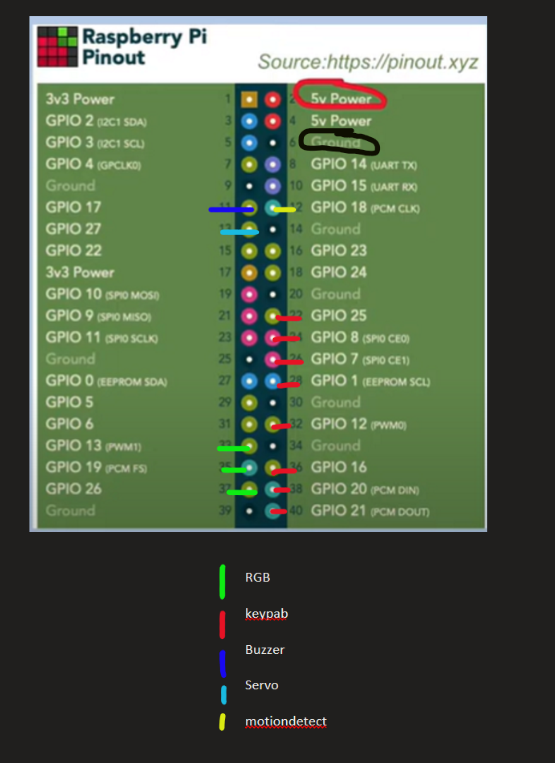

# SecurityDoor
This project is an IoT-based home security solution that uses a Raspberry Pi, motion detector, camera, keypad, RGB LED, and buzzer to secure the entrance to your house. It provides password-based access control, real-time notifications, and logs of entry attempts.

## Features
- motion dectector triggers the system activation
- LED and buzzer change bahvior based on user input (welcome, warning, alert)
- password access via keypad
- servo motor controll the door lock
- automatic picture capture upon access attempt 
- remote picture upload
- admin can fully control the whole system, receive notification for inccorrect password 5 attemps

## components
- **Raspberry Pi** (main controller)
- **Camera** (for capturing images)
- **PIR Motion Sensor** (to detect movement near the door)
- **LED** (visual feedback: green for access granted, red for access denied)
- **Buzzer** (sound feedback: welcome sound for success, warning for failure)
- **Keypad** (for entering the password)
- **Servo Motor** (for controlling door lock)
- **Remote Database** (to store captured images and access logs)

## How it works 
1. **Motion detection**: when the motion senor see someone near the door the system will automatic turn on (LED turn on, buzzer welcome sound, keypad is ready to input the password, turn camera on).
2. **Password input**: the visitor input a password on the keypad.
    - **corect password**: the servo motor will move to unlock the door, take a picture of visitor and upload on remote database, led turn green, coming sound.
    - **Incorect Password**: 
        -**3 wrong attempts**: LED will turn to yellow, warning sound.
        -**5 wrong attempts**: LED turn red, alert sound, send notification for admin, take picture and send red code on remote database.

## Set up 
1. **Hardware setup**:
    - **Camera** using camera for raspberry pi
    - **PIR Motion Sensor** GPIO 18
    - **LED RGB** red= GPIO 13, green= GPIO 19, blue= GPIO 26
    - **Buzzer** GPIO 17
    - **Keypad** 
        GPIO L1 = 25, L2 = 8, L3 = 7, L4 = 1
             C1 = 12, C2 = 16, C3 = 20, C4 = 21
    - **Servo Motor** GPIO 27
    **note:** this pin maybe different depend on your raspberry version (the map ahead is raspberry pi 4)
    

2. **software setup**
    - **python code:**try to connect each component and run the code in the examples foulder for each components to testing purpose.
    if everything is good, we can setup every components then run the main code. 
    - **create service:** this part use to trigger the system 
